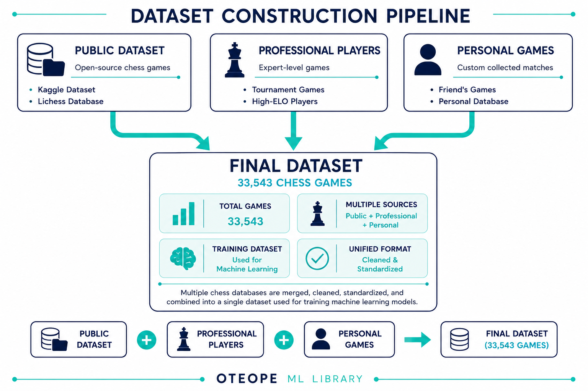
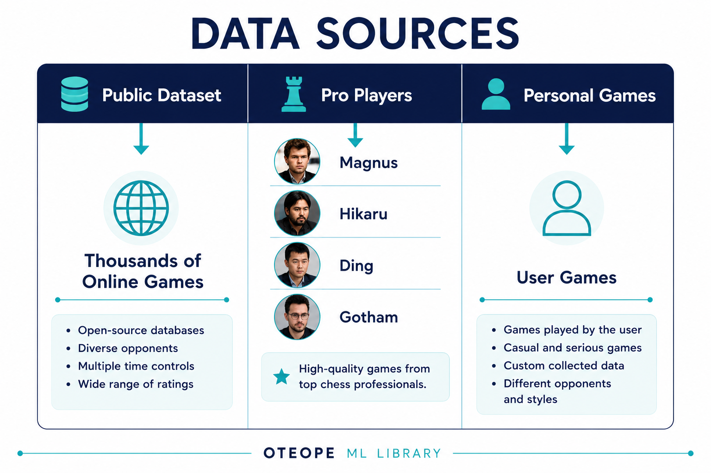
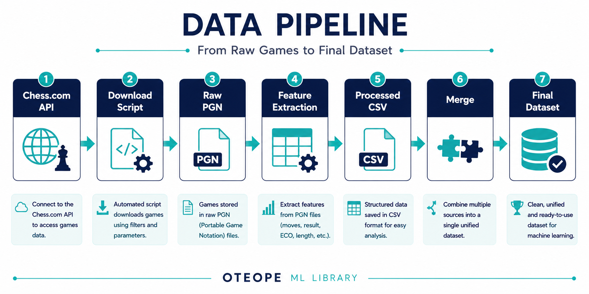
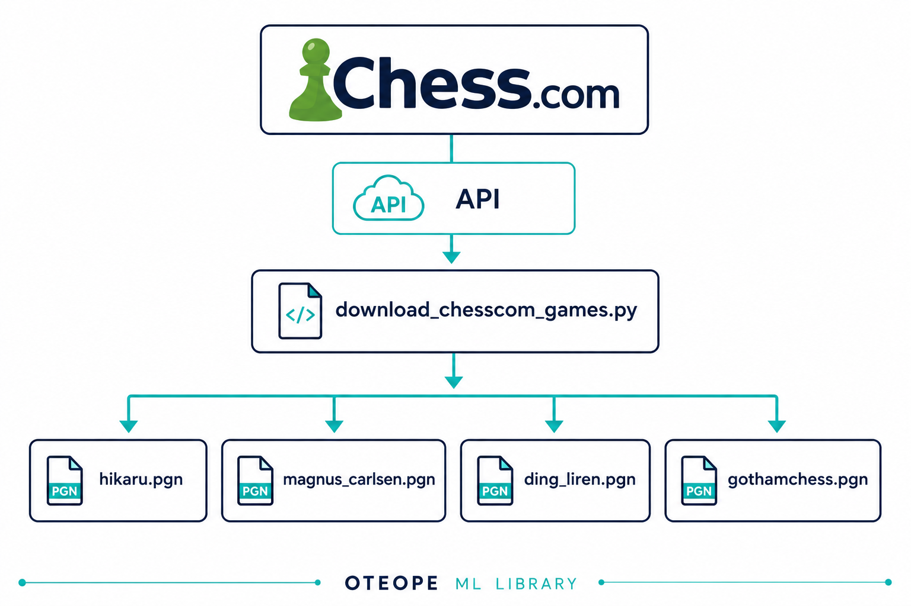
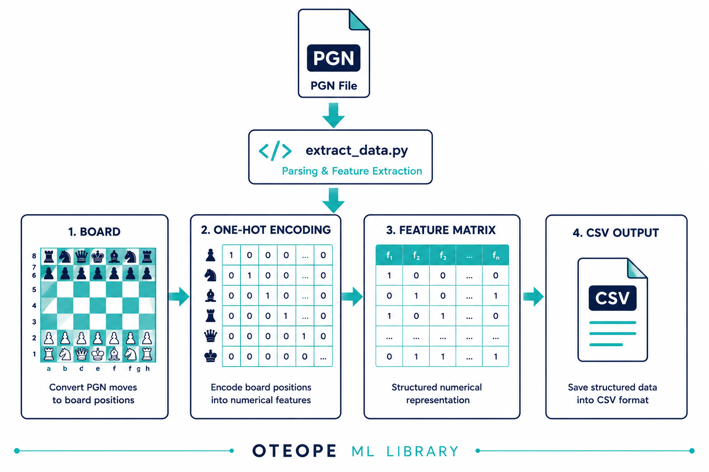
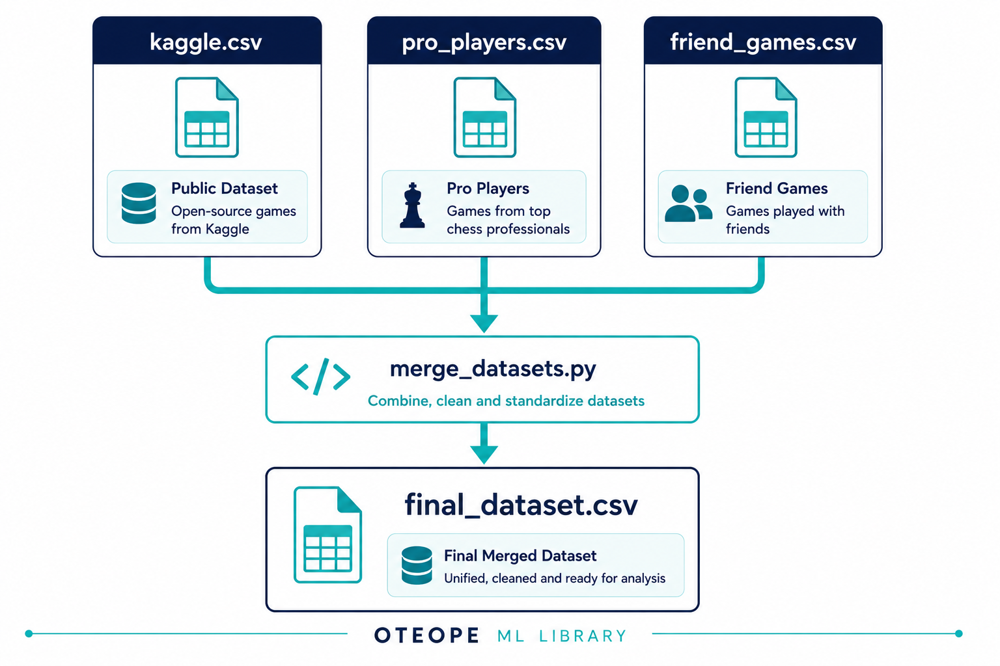

# ♟️ Chess Opening Predictor

> **How much information about the final outcome of a chess game is already contained in the opening?**

    

## 📖 Project Overview

Chess engines evaluate millions of positions every second using handcrafted heuristics and deep search algorithms.

This project deliberately takes a different direction.

Instead of building another chess engine, it investigates how much predictive information is already contained in the opening phase of a chess game.

Each game is represented only by:

- the board position after move 10,
- White Elo,
- Black Elo,
- Elo Difference.

No chess heuristics, engine evaluations or handcrafted positional features are provided to the models.

The project benchmarks a classical Machine Learning approach (Random Forest) against a Deep Learning approach (Multi-Layer Perceptron implemented in PyTorch) under identical experimental conditions.

## 🎯 Research Question

This project aims to answer a simple but meaningful research question:

> **How much predictive information about the final outcome of a chess game is already contained in the opening?**

More specifically, the project investigates:

- Can the geometry of the board after move 10 predict the final result?
- How much predictive power comes from player strength alone?
- Does combining board geometry with Elo ratings improve prediction?

## 💡 Motivation

Modern chess engines achieve outstanding performance by combining handcrafted evaluation functions with powerful search algorithms.

This project intentionally avoids that approach.

Instead of relying on expert chess knowledge, the models receive only a raw representation of the board together with the players' ratings.

By removing manually engineered chess heuristics, the project focuses entirely on the ability of Machine Learning algorithms to discover useful patterns directly from historical data.

The objective is not to create a stronger chess engine, but to study the predictive information already present in chess openings.

# 📊 Dataset Construction

The dataset was built by combining multiple complementary sources to maximize data diversity while maintaining high-quality chess games.

Rather than relying on a single dataset, this project combines public online games, professional players and personal games into a unified machine learning dataset.

At the end of the preprocessing pipeline, the final dataset contains:

| Metric | Value |
|---------|------:|
| Total Games | **33,543** |
| Representation | Board after move 10 |
| Features | 771 |
| Target Classes | White Win / Draw / Black Win |

    

## 📚 Data Sources

The final dataset combines three complementary sources.

Each source contributes different characteristics that improve the diversity and realism of the training data.

| Source | Description |
|---------|-------------|
| Kaggle Dataset | Public online chess games |
| Professional Players | Magnus, Hikaru, Ding Liren and GothamChess |
| Personal Games | Games played by a friend |

### 📚 Public Dataset

A large public dataset containing online chess games played by users with different Elo ratings.

This source provides a broad distribution of openings, player strengths and game outcomes, allowing the models to learn from realistic online chess scenarios.

---

### ♔ Professional Players

Professional games were collected directly from the Chess.com Public API.

The selected players were:

- Magnus Carlsen
- Hikaru Nakamura
- Ding Liren
- GothamChess

To avoid overrepresenting any individual player, the preprocessing pipeline limits each player to a maximum of **5,000 successfully processed games**.

This keeps the professional subset balanced while still exposing the models to high-quality chess.

These players were selected to expose the models to different playing styles while covering both elite competitive chess and high-level educational content.

---

### 👤 Personal Games

Finally, personal games were incorporated into the dataset.

Including games from the target user distribution allows evaluating whether the models generalize beyond professional chess and public datasets.

The combination of all three sources produces a more diverse dataset than relying on any individual source.

    

# ⚙️ Data Collection Pipeline

Instead of manually downloading and preprocessing chess games, a complete automated pipeline was developed.

The pipeline downloads raw PGN files, extracts structured features and merges every source into a single machine learning dataset.

    

## 1. Download

Professional games are downloaded automatically from the Chess.com Public API.

The downloader retrieves every monthly archive available for each player and stores all games as PGN files.

This process is fully automated and reproducible.

    

## 2. Feature Extraction

Raw chess games (CSV or PGN) files cannot be used directly by Machine Learning models.

The extraction pipeline parses every game, validates its quality and converts the board position after move 10 into a numerical representation.

Each processed game includes:

- White Elo
- Black Elo
- Elo Difference
- Opening Name
- ECO Code
- Board One-Hot Encoding (768 features)
- Game Result

    

## 3. Dataset Merging

After preprocessing every source independently, all processed datasets are merged into a single dataset used for model training.

This guarantees that every source follows exactly the same feature representation and preprocessing pipeline.

    

## 📁 Dataset Organization

data/
├── raw/
│   ├── kaggle_dataset.csv
│   ├── friend_games.pgn
│   └── pro_players/
│       ├── magnus_carlsen.pgn
│       ├── ding_liren.pgn
│       ├── gothamchess.pgn
│
├── processed/
│   ├── processed_kaggle.csv
│   ├── friend_games_processed.csv
│   ├── final_dataset.csv
│   └── pro_players/
│       ├── magnus_carlsen_processed.csv
│       ├── ding_liren_processed.csv
│       ├── gothamchess_processed.csv
│       └── pro_players_processed.csv