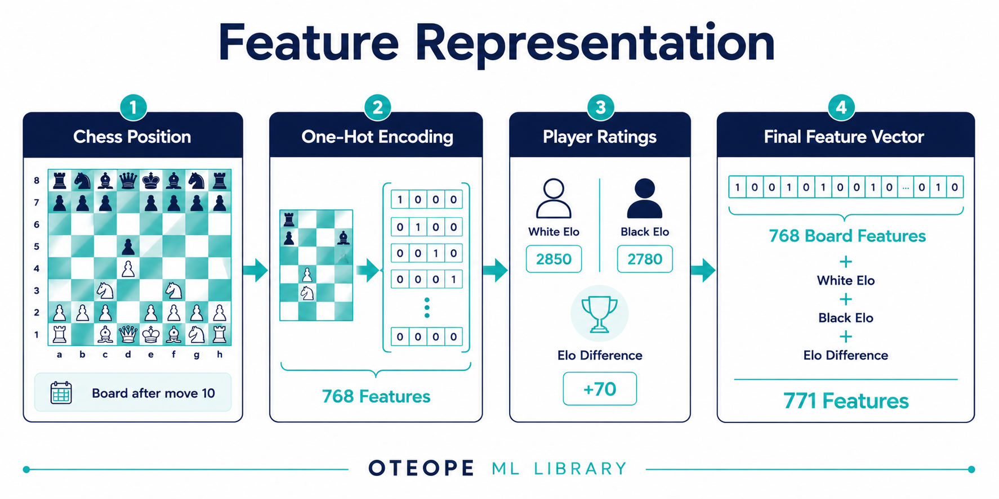
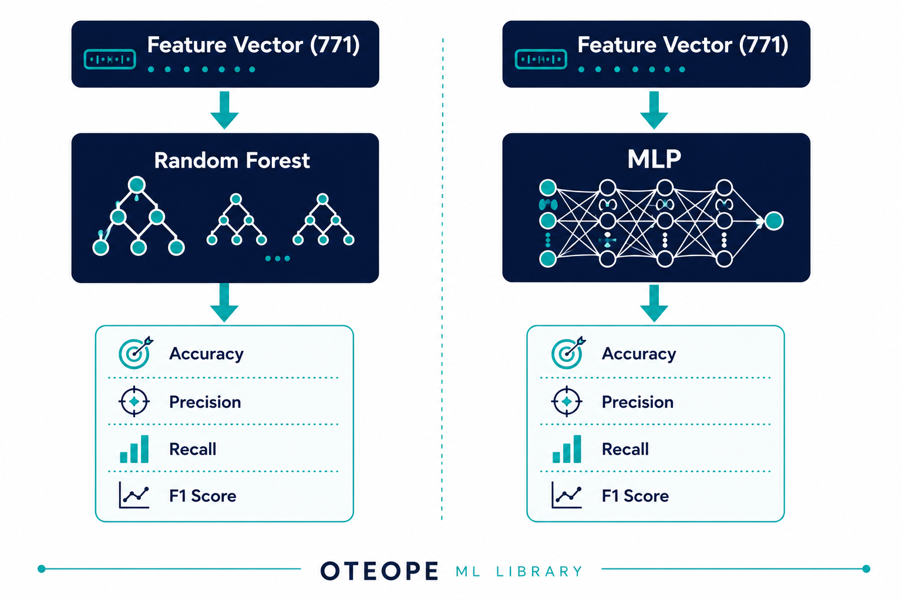

# ♟️ Chess Opening Predictor


> **How much information about the final outcome of a chess game is already contained in the opening?**

<p align="center">
    
</p>

## 📖 Project Overview

Chess engines evaluate millions of positions every second using handcrafted heuristics and deep search algorithms.

This project deliberately takes a different direction.

Instead of building another chess engine, it investigates how much predictive information is already contained in the opening phase of a chess game.

Each game is represented only by:

- the board position after move 10,
- White Elo,
- Black Elo,
- Elo Difference.

No chess heuristics, engine evaluations or handcrafted positional features are provided to the models.

The project benchmarks a classical Machine Learning approach (Random Forest) against a Deep Learning approach (Multi-Layer Perceptron implemented in PyTorch) under identical experimental conditions.

The project was developed following a complete end-to-end Machine Learning workflow, from automated data collection to model evaluation and result generation.

## 🎯 Research Question

This project aims to answer a simple but meaningful research question:

> **How accurately can Machine Learning predict the outcome of a chess game using only the opening position and player ratings?**

More specifically, the project investigates:

- Can the geometry of the board after move 10 predict the final result?
- How much predictive power comes from player strength alone?
- Does combining board geometry with Elo ratings improve prediction?

## 💡 Motivation

Modern chess engines achieve outstanding performance by combining handcrafted evaluation functions with powerful search algorithms.

This project intentionally avoids that approach.

Instead of relying on expert chess knowledge, the models receive only a raw representation of the board together with the players' ratings.

By removing manually engineered chess heuristics, the project focuses entirely on the ability of Machine Learning algorithms to discover useful patterns directly from historical data.

The objective is not to create a stronger chess engine, but to study the predictive information already present in chess openings.

# 📊 Dataset Construction

The dataset was built by combining multiple complementary sources to maximize data diversity while maintaining high-quality chess games.

Rather than relying on a single dataset, this project combines public online games, professional players and personal games into a unified machine learning dataset.

At the end of the preprocessing pipeline, the final dataset contains:

| Metric | Value |
|---------|------:|
| Total Games | **33,543** |
| Representation | Board after move 10 |
| Features | 771 |
| Target Classes | White Win / Draw / Black Win |

<p align="center">
    
</p>

## 📚 Data Sources

The final dataset combines three complementary sources.

Each source contributes different characteristics that improve the diversity and realism of the training data.

| Source | Description |
|---------|-------------|
| Kaggle Dataset | Public online chess games |
| Professional Chess.com Accounts| Magnus, Hikaru, Ding Liren and GothamChess |
| Personal Games | Games played by a friend |

### 📚 Public Dataset

A large public dataset containing online chess games played by users with different Elo ratings.

This source provides a broad distribution of openings, player strengths and game outcomes, allowing the models to learn from realistic online chess scenarios.

---

### ♔ Professional Players

Professional games were collected directly from the Chess.com Public API.

The selected players were:

- Magnus Carlsen
- Hikaru Nakamura
- Ding Liren
- GothamChess

To avoid overrepresenting any individual player, the preprocessing pipeline limits each player to a maximum of **5,000 successfully processed games**.

This keeps the professional subset balanced while still exposing the models to high-quality chess.

These players were selected to expose the models to different playing styles while covering both elite competitive chess and high-level educational content.

---

### 👤 Personal Games

Finally, personal games were incorporated into the dataset.

Including games from the target user distribution allows evaluating whether the models generalize beyond professional chess and public datasets.

The combination of all three sources produces a more diverse dataset than relying on any individual source.

<p align="center">
    
</p>

# ⚙️ Data Collection Pipeline

Instead of manually downloading and preprocessing chess games, a complete automated pipeline was developed.

The pipeline downloads raw PGN files, extracts structured features and merges every source into a single machine learning dataset.

<p align="center">
    
</p>

## 1. Download

Professional games are downloaded automatically from the Chess.com Public API.

The downloader retrieves every monthly archive available for each player and stores all games as PGN files.

This process is fully automated and reproducible.

<p align="center">
    
</p>

## 2. Feature Extraction

Raw chess games (CSV or PGN) files cannot be used directly by Machine Learning models.

The extraction pipeline parses every game, validates its quality and converts the board position after move 10 into a numerical representation.

Each processed game includes:

- White Elo
- Black Elo
- Elo Difference
- Opening Name
- ECO Code
- Board One-Hot Encoding (768 features)
- Game Result

<p align="center">
    
</p>

## 3. Dataset Merging

After preprocessing every source independently, all processed datasets are merged into a single dataset used for model training.

This guarantees that every source follows exactly the same feature representation and preprocessing pipeline.

<p align="center">
    
</p>


## 📁 Dataset Organization

```text
data/
├── raw/
│   ├── kaggle_dataset.csv
│   ├── friend_games.pgn
│   └── pro_players/
│       ├── magnus_carlsen.pgn
│       ├── ding_liren.pgn
│       ├── gothamchess.pgn
│
├── processed/
│   ├── processed_kaggle.csv
│   ├── friend_games_processed.csv
│   ├── final_dataset.csv
│   └── pro_players/
│       ├── magnus_carlsen_processed.csv
│       ├── ding_liren_processed.csv
│       ├── gothamchess_processed.csv
│       └── pro_players_processed.csv
```

# ♟️ Feature Representation

Raw chess boards cannot be processed directly by traditional Machine Learning algorithms.

Each board position after move 10 is therefore transformed into a fixed-length numerical representation that preserves the complete arrangement of the pieces while remaining suitable for both classical Machine Learning and Deep Learning models.

The final feature vector combines board geometry with player strength information.

The representation consists of:

- **768 board features** obtained through One-Hot Encoding.
- **White Elo**
- **Black Elo**
- **Elo Difference**

This produces a total of **771 numerical input features** for every chess game.

Unlike chess engines, no handcrafted positional heuristics or engine evaluations are included.

The models receive only the raw board configuration together with the players' ratings, allowing them to learn meaningful patterns directly from historical data.

| Feature | Description |
|---------|-------------|
| One-Hot Board Encoding | 768 binary features representing the board after move 10 |
| White Elo | White player's rating |
| Black Elo | Black player's rating |
| Elo Difference | White Elo − Black Elo |

<p align="center">
    
</p>

# 🧠 Model Architecture

Two fundamentally different Machine Learning approaches were selected for this project.

The objective is not only to maximize predictive performance, but also to compare how a classical Machine Learning algorithm behaves against a Deep Learning model when both receive exactly the same input representation.

Both models are trained on the identical dataset using the same train-test split and feature representation, ensuring a fair comparison.

## 🌲 Random Forest

The first model is a **Random Forest Classifier**, an ensemble learning algorithm that combines multiple decision trees to improve predictive performance and reduce overfitting.

Random Forests are particularly well suited for structured tabular data because they can model highly non-linear relationships while requiring very little feature engineering.

In this project, the model receives the complete feature vector composed of:

- One-Hot encoded board representation
- White Elo
- Black Elo
- Elo Difference

The final prediction is obtained through majority voting across all decision trees in the ensemble.

## 🧠 Multi-Layer Perceptron (MLP)

The Deep Learning approach is implemented using a fully connected Multi-Layer Perceptron developed with PyTorch.

Unlike Random Forests, neural networks learn hierarchical feature representations through multiple hidden layers.

The network receives exactly the same input vector used by the Random Forest and attempts to learn complex interactions between board geometry and player strength directly from data.

The architecture consists of four hidden layers followed by a three-neuron output layer corresponding to the three possible game outcomes:

- White Win
- Draw
- Black Win

Batch Normalization and ReLU activation functions are applied after every hidden layer to improve training stability and convergence.

## ⚖️ Why Compare These Models?

Random Forests and Multi-Layer Perceptrons represent two very different Machine Learning paradigms.

Random Forests partition the feature space using ensembles of decision trees, whereas neural networks learn continuous representations through gradient-based optimization.

Comparing both approaches under identical experimental conditions provides insight into whether the information contained in chess openings is better captured by ensemble methods or by representation learning.

This comparison also highlights the strengths and limitations of classical Machine Learning versus Deep Learning for structured chess data.

# 🤖 Model Development

Two different machine learning approaches were investigated throughout this project:

- **Random Forest**, representing a classical Machine Learning algorithm.
- **Multi-Layer Perceptron (MLP)** implemented in PyTorch, representing a Deep Learning approach.

Rather than evaluating a single configuration, both models were developed through an iterative experimentation process involving multiple architectures and hyperparameter combinations.

The objective was not simply to maximize accuracy, but also to understand how different design decisions affected the prediction of the three possible game outcomes (White Win, Draw and Black Win).

> **Note:** The Random Forest experiments were trained using a **771-feature representation**, while the final MLP experiments used a slightly extended **774-feature representation** after additional preprocessing. The results reported in this repository correspond to the final optimized pipeline for each model.

<p align="center">
    
</p>


## 🌳 Random Forest

Five different Random Forest configurations were evaluated during development.

The experiments explored:

- Number of estimators
- Maximum tree depth
- Feature subsampling (`max_features`)
- Class weighting for imbalanced classes

The results showed that increasing the number of trees slightly improved predictive performance, while restricting tree depth generally reduced accuracy.

Introducing class weighting significantly improved the detection of **Draws**, although this came at the expense of lower overall accuracy.

The final Random Forest selected for comparison provides the best trade-off between predictive performance and class balance.

## 🧠 Multi-Layer Perceptron (PyTorch)

Nine different neural network configurations were evaluated throughout the project.

The experimentation process explored several aspects of the architecture and optimization strategy, including:

- Different network depths
- Larger hidden layers
- Manual and automatic class weighting
- Batch Normalization
- Learning-rate scheduling
- Regularization with Dropout

Early experiments completely ignored the minority **Draw** class due to the dataset imbalance.

Subsequent experiments improved draw recognition by introducing Batch Normalization and alternative loss weighting strategies, although these improvements generally reduced the overall classification accuracy.

Increasing network capacity and optimization complexity produced only marginal gains, suggesting that the primary limitation lies in the information contained within the input representation rather than in the model architecture itself.